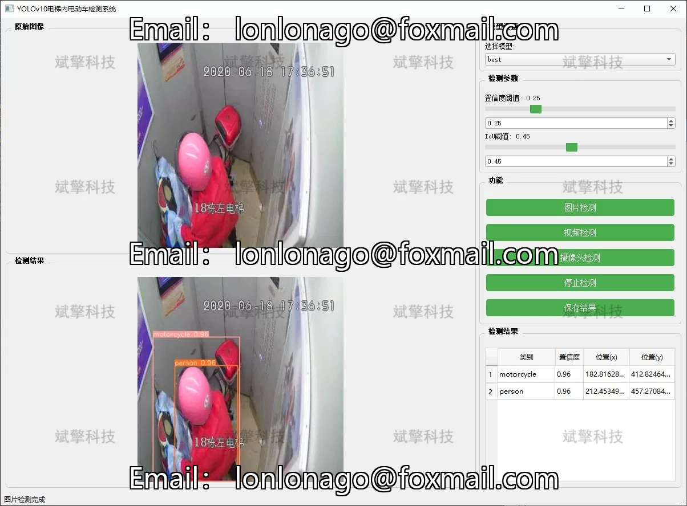
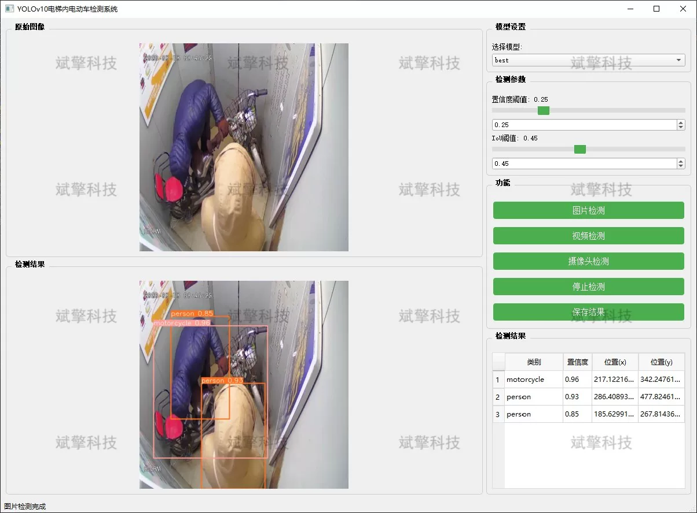
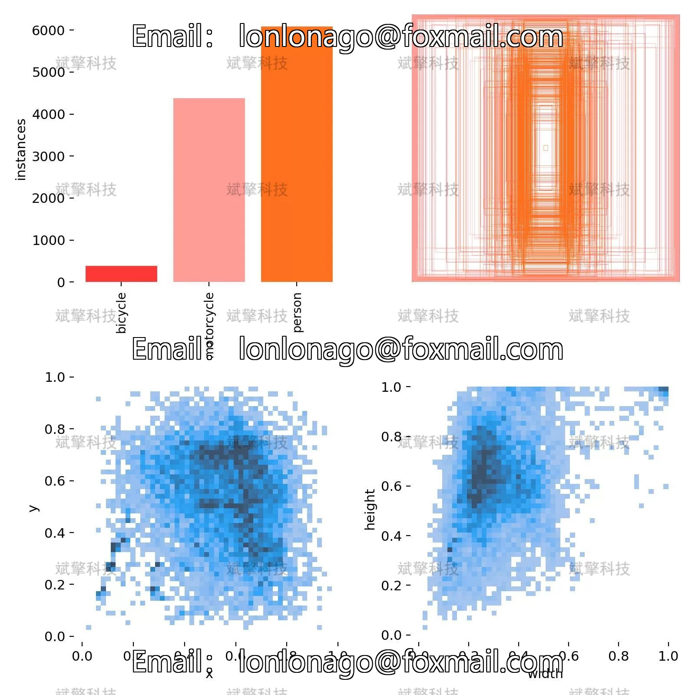
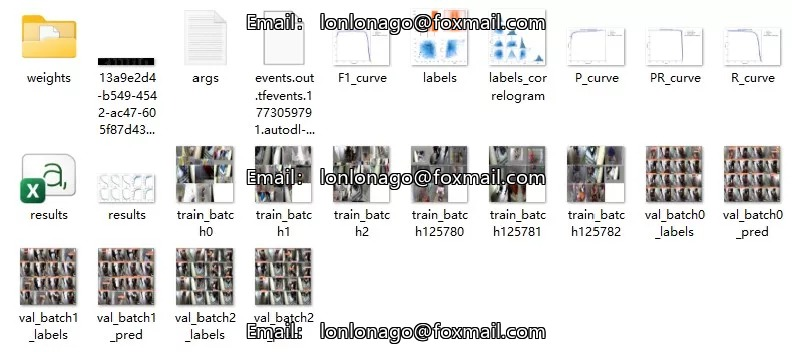
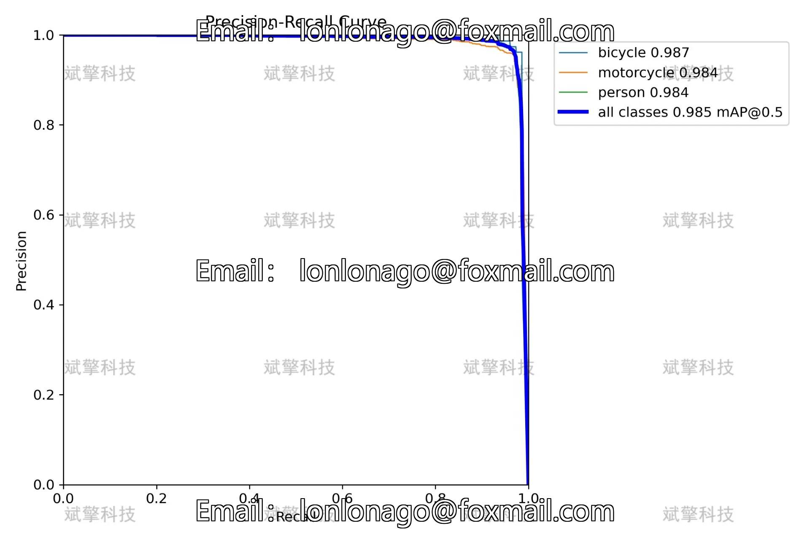
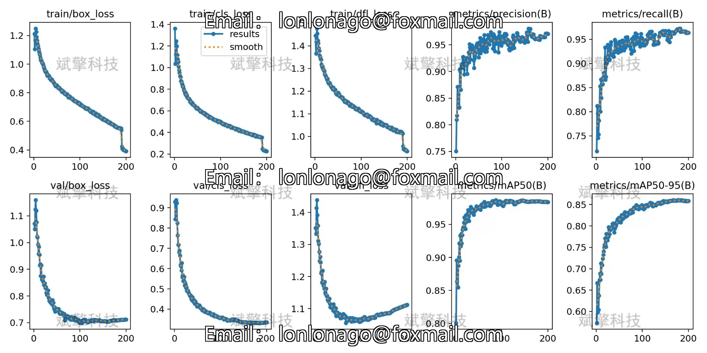

# YOLOv10 Elevator Electric Vehicle Detection System

## Body

The elevator E-bike detection system based on YOLOv10 deep learning, including the YOLOv10+YOLO dataset, UI interface, Python project and model.

This system is based on the latest YOLOv10 object detection algorithm and developed a set of elevator electric vehicle detection system.

The system can identify electric vehicles, motorcycles and pedestrians in elevator monitoring images in real time. When an electric vehicle enters the elevator, it can trigger an alarm or link to the elevator control system to prevent the elevator from closing. The system supports three modes of image detection, video file detection and real-time camera detection, which can be flexibly deployed in various types of elevator scenes, providing intelligent protection for the safe operation of elevators.

In response to the safety hazards caused by electric vehicles entering elevators, this paper designs and implements a system for detecting electric vehicles in elevators based on the YOLOv10 deep learning model. The system adopts YOLOv10 as the core detection algorithm, which maintains high detection accuracy while improving inference speed through optimization of the model structure, making it more suitable for real-time monitoring scenarios.

System Functions

✅ Image detection: Can detect images and return detection boxes and category information.

✅ Video Detection: Supports video file input, detecting the situation of each frame in the video.

✅ Real-time Camera Detection: Connect a USB camera to achieve real-time monitoring.

✅ Real-time parameter adjustment (confidence and IoU threshold)

Dataset Introduction

Training set: 5291 images
Validation set: 1168 images
Test set: 652 images

## Images

## Payment

Here is a pay link on Stripe ( https://buy.stripe.com/3cs8yP7sY87d0vu9AB ). Please contact me lonlonago@foxmail.com after funding $89, and I will send you a complete data files , thank you!

